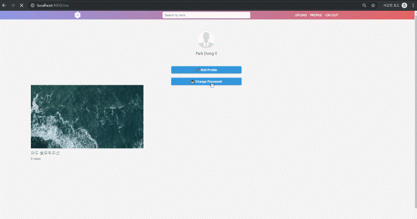

# WeTube

========

## Description

---

    * Youtube 화면을 모티브로 하여 클론코딩
    * HTML, CSS, JavaScript, mongoDB, expressJS, Webpack을 이용하여 화면을 구현

## Pages

---

- [x] Home
- [x] Join
- [x] Login
- [x] Search
- [x] User Detail
- [x] Edit Profile
- [x] Change Password
- [x] Upload
- [x] Video Detail
- [x] Edit Video

## Main function

---

### Upload

    

### Change Password

    

### Edit Video

    
